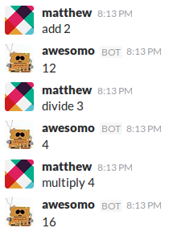
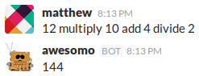
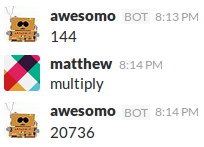

Haskell Math Bot
----------------

<p align="center">
    
</p>

This is a slack bot that does math. It understands integers and the operations
add, subtract, multiply and divide. Division is integerwise.

It remembers the last value which is used whenever a number should otherwise be
present. That means you can say `add 1` and it will increment the last value by
one and say it.

It uses the arbitrary precision `Integer` type for tracking this value, so the
numbers it can calculate can get very large.

It will exit immediately with an error if it cannot handle a statement.

### Layout

Application code goes in `src` and the entry point is the `main` method of `src/Main.hs`.

Dependencies go in `haskell-math-bot.cabal`. When you change dependencies you must rebuild the image.

There are scripts to build and run the code in the `bin` folder.

### Usage

This reads the slack token from a file called `token` in the root directory of the project. This must be present.

```bash
➜ bin/clean
➜ bin/build
➜ bin/start
...
```

Use Control-C to stop it.

#### bin/build

This downloads the stack dependencies and builds the code.

This does not run `stack setup` which is required if you lack the version of
GHC that this is expecting (7.10). This command will tell you if that is the
case.

#### bin/clean

This removes any downloaded dependencies or compiled code.

#### bin/start

This starts the slack bot.

### Example

Here is an example of using the bot.


Just saying a constant makes the bot repeat it, and thus resets the number.



The examples of adding, dividing and multiplying the current number work by
replacing the missing number with the last value.



A chain of operations is evaluated right to left. So the chain becomes
`12 * (10 + (4 / 2))` which is `12 * 12`.



You are not restricted to one missing value, so `multiply` will multiply the
current value _by itself_.
